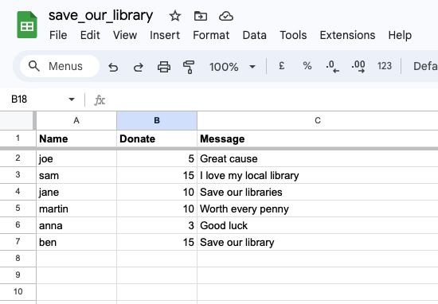
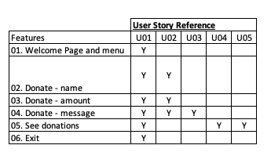
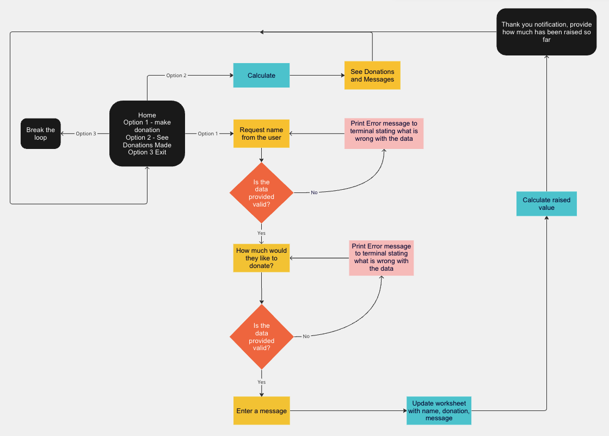
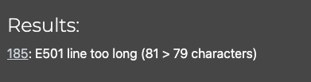
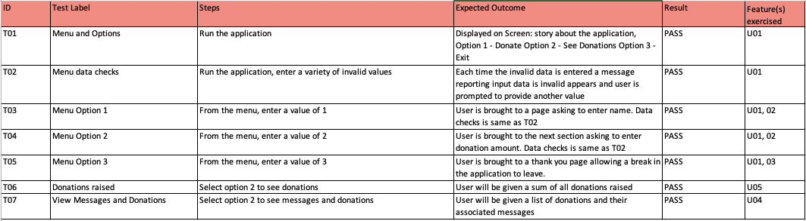
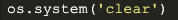
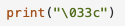

<h1>Save Our Library</h1>

[View the live project here](https://save-our-library-c912e53ed8f7.herokuapp.com/)

Save Our Library is a command line application to raise funds for local libraries.

The user can interact with the application to make a donation and view other donations made.

The fundraising data is stored in an external Google Spreadsheet.

## Index - Table of Contents
* [User Experience (UX)](#user-experience-ux)
* [Features](#features)
* [Design](#design)
* [Technologies Used](#technologies-used)
* [Testing](#testing)
* [Deployment](#deployment)
* [Credits](#credits)

## User Experience (UX)

### User stories - as a used I want to be able to :

1. Easily navigate between the different functions available in the application.
2. Be able to donate.
3. Be able to leave a message with my donation.
4. View other donations and messages.
5. Be able to see how much has been donated.

## Features

### Existing Features

1. Welcome page and menu
- The main menu is displayed when the application starts. To keep it simple to use, the menu is divided into 3 options.
Option 1 - Donate
Option 2 - See Donations
Option 3 - Exit
- The user is prompted to choose one of the menu options by entering a number and if input incorrectly, an error message will be displayed until the user has input a correct option.

2. Donate - Submit Name:
- The Donate - Submit Name is first requested when the user selects Option 1 - Donate.
- The user is prompted to provide a name or type anonymous if they dont want to give their details. If symbols, numbers or blank is input an error message will be displayed until the user has input a correct option.

3. Donate - enter amount:
- The Donate - Enter Amount is then requested after the user has provided their name. They are asked to input how much they would like to donate, rounded to the pound. If letters, symbols or blanks are input an error message will be displayed until the user has input a correct option.

4. Donate - leave a message:
- The Donate - leave a message is finally requested for the user to write anything down that will appear on the wall for viewers to see. This option can be left blank.

5. See other donations and messages:
- The user can view all donations and messages that are input retrospectively, including their own once submitted.
- The total raised is also provided.

- Below is an image of the data that is input into the worksheet:

6. Exit:
- The user can leave the application completely when finished and will be provided with a message.

### How these features support the User Stories

The User Stories in the User Experiences(UX) part of this document is numbered 1 to 5. Below is a traceability matrix cross-referencing the user stories with the features, illustrating which features support which stories:

### Features which could be implemented in the future
- UI
It would be friendlier for the user if a user-interface layer was built using HTML/ CSS and possibly Javascript.

- Calculate monthly donations
It would be interesting for the user to see how many donations were made in a time frame. This would require a date stamp.

- User account
It would be useful for the user (and for the ficitional site) to encourage users to donate often and they can see what they have donated.

## Design

### Flow Chart
The diagram below outlines the flow of control within the application :

## Technologies Used

### Languages Used

- [Python 3.11.4] (https://www.python.org/)

### Frameworks, Libraries & Programs Used

- [Google Speadsheets:](https://en.wikipedia.org/wiki/Google_Sheets) used as an external data store for the Events and Bookings data used by the project.
- [Google Drive API:](https://developers.google.com/drive/api/v3/about-sdk) used to generate credentials used in the project to securely access the Google Spreadsheet.
- [Google Sheets API:](https://developers.google.com/sheets/api) used to support interactions (e.g. read/write functionality) between the code and data stored in the Google Spreadsheet.
- [Google Auth:](https://google-auth.readthedocs.io/en/master/) Google authentication library for Python required to use the credentials generated for Google Drive API.
- [Miro:] (https://miro.com/) was used to create the flow chart.
- [Git:](https://gitscm.com/) was used for version control by utilising the Gitpod terminal to commit to Git and Push to GitHub.
- [GitHub:](https//github.com/) is used as the repository for the projects code after being pushed from Git.
- [Heroku:](https://heroku.com) is used to deploy the application and provides an environment in which the code can execute.

## Testing

### Validator Testing

- [Python Validator](https://pep8ci.herokuapp.com/)

- result for run.py

The below shows that a line is over 80 characters wrong - I can confirm that this has been checked and is less that 80 characters.

### Test Cases and Results

- The below table details the test cases that were used, the results and a cross-reference to the Feature ID that each test case exercised:

### Known Bugs

- Problem with clear screen: 
Was using the below to clear the screen which didnt work as soon as application was deployed in Heroku.

I used the below code to try and this seems to have worked.

The link can be found here: [Clear Screen](https://stackoverflow.com/questions/2084508/clear-terminal-in-python/2084521)

## Deployment

### How to clone the GitHub repository
1. Navigate to the repository
2. In the top-right corner of the page click on the fork button and select "Create a fork"
3. Change the name of the fork and add a description
4. Choose to copy only the main branch of the new fork
5. Click "Create a Fork". A new repository should appear in your GitHub

### How to create and configure the Google speadsheet and APIs
The application stores data in a Google Sheet. The credentials for the communicating with the sheet should be saved in a file tited creds.json. To generate your Google Sheet credentials, follow these steps:

1. Go to the [Google Developers Console](https://console.developers.google.com/)
2. Create a new project
3. Enable the Google Drive API
4. Create credentials for a Web Server to access Application Data
5. Name the service account and grant it a Project Role of Editor
6. Download the JSON file
7. Copy the JSON file to your code directory and rename it to creds.json
8. In the JSON file, change the email address to the one you are sharing your Google Sheet with
9. In the Google Sheet, share the sheet with the email address in the JSON file

### How this site was deployed to Heroku

- To deploy the project on Heroku, first create an account.
- Once logged in, create a new app by clicking on the create app button
- Pick a unique name for the app, select a region, and click create app
- On the next page select the settings tab and scroll down to Config Vars. If there are any filed that should be hidden like credentials and API keys they should be added here. In this project, there are credentials that need to be protected. To do this I have created a config var and added CREDS as the key and the content of the creds.json file as a value.
- Scroll down to buildpacks. The Buildpacks will install further dependences that are not included in the 'requirements.txt'. For this project, there are two Buildpacks required - Python and Nodejs.
- Select the deploy section from the tab in the menu.
- The deployment method of this project is GitHub. Once selected, confirm that we want to connect to GitHub, search for the repository name and click connect to connect the Heroku app to our GitHub code.
- Scroll further down to the deploy section where automatic deplys (I currently have mine set to manual) can be enabled, which means that the app will update every time the code is pushed to GitHub. Click deploy and wait for the app to be built. One this is done, a message should appear letting us know that the app was successfully deployed with a view button to see the app.

## Credits

### Content
- The Google spreadsheet that the application uses has the following initial data which was set up manually (fictitious):

### Code

- [W3Schools](https://www.w3schools.com/python/) was used throughout to get guidance on functions and data validation.
- [Clearscreen](https://stackoverflow.com/questions/2084508/clear-terminal-in-python/2084521) was used to resolve the clear screen function.
- [Local Variables](https://www.programiz.com/python-programming/global-local-nonlocal-variables#:~:text=Python%20Local%20Variables,access%20them%20outside%20the%20function.&text=Here%2C%20the%20message%20variable%20is,be%20accessed%20within%20the%20function.) was used to access varibales within the function.

### Acknowledgements

- Thank you to my mentor Elaine Roche for the continued support and feedback. Provided me with lots of guidance on keeping my design simple and extra nice to haves to enhance my python coding.