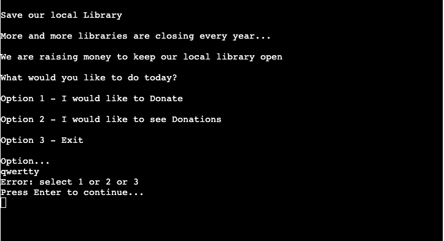
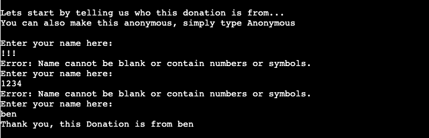
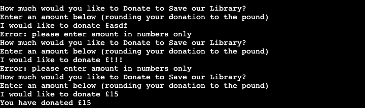
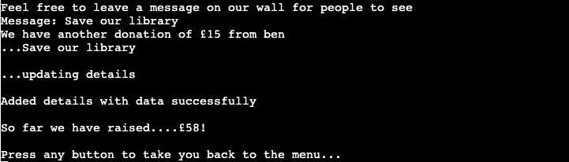

<h1>Save Our Library</h1>

[View the live project here](https://save-our-library-c912e53ed8f7.herokuapp.com/)

Save Our Library is a command line application to raise funds for local libraries.

The user can interact with the application to make a donation and view other donations made.

The fundraising data is stored in an external Google Spreadsheet.

## Index - Table of Contents
* [User Experience (UX)]
* [Features]
* [Design]
* [Technologies Used]
* [Testing]
* [Deployment]
* [Credits]

## User Experience (UX)

### User stories - as a used I want to be able to :

1. Easily navigate between the different functions available in the application.
2. Be able to donate.
3. Be able to leave a message with my donation.
4. View other donations and messages.
5. Be able to see how much has been donated.

## Features

### Existing Features

1. Welcome page and menu
- The main menu is displayed when the application starts. To keep it simple to use, the menu is divided into 3 options.
Option 1 - Donate
Option 2 - See Donations
Option 3 - Exit
- The user is prompted to choose one of the menu options by entering a number and if input incorrectly, an error message will be displayed until the user has input a correct option.

2. Donate - Submit Name:
- The Donate - Submit Name is first requested when the user selects Option 1 - Donate.
- The user is prompted to provide a name or type anonymous if they dont want to give their details. If symbols, numbers or blank is input an error message will be displayed until the user has input a correct option.

3. Donate - enter amount:
- The Donate - Enter Amount is then requested after the user has provided their name. They are asked to input how much they would like to donate, rounded to the pound. If letters, symbols or blanks are input an error message will be displayed until the user has input a correct option.

4. Donate - leave a message:
- The Donate - leave a message is finally requested for the user to write anything down that will appear on the wall for viewers to see. This option can be left blank.

5. See other donations and messages:
- The user can view all donations and messages that are input retrospectively, including their own once submitted.
- The total raised is also provided.

6. Exit:
- The user can leave the application completely when finished and will be provided with a message.

### How these features support the User Stories

### Features which could be implemented in the future
- how many donations were made in a month
- how many donations were made by a specific person

## Design

### Flow Chart

## Technologies Used

### Languages Used

- [Python 3.8.10] (https://www.python.org/)

## Testing

### Validator Testing

- [Python Validator](https://pep8online.com/)

- result for run.py

### Test Cases and Results

- The below table details the test cases that were used, the results and a cross-reference to the Feature ID that each test case exercised:

### Known Bugs

## Deployment

### How to clone the GitHub repository

### How to create and configure the Google speadsheet and APIs

### How this site was deployed to Heroku

## Credits

### Content

### Code

### Acknowledgements